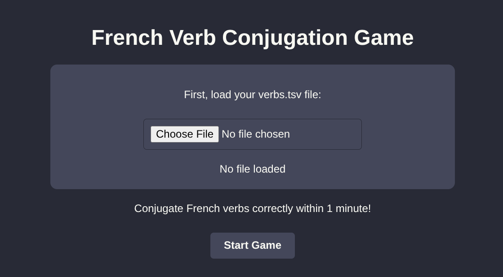
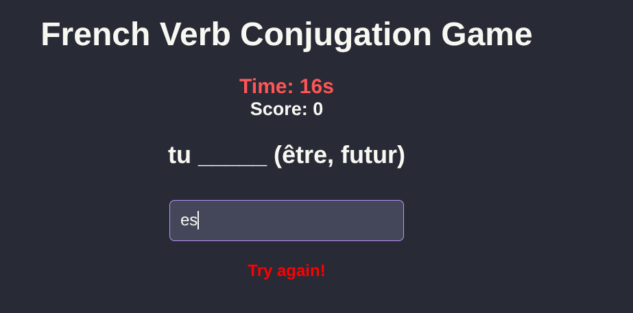

# French-Verb-Conjugation-Game
A minimal web-based game to practice French verb conjugations 

## About

I created this game as a personal learning tool. I found that typing out conjugations helps with muscle memory and active recall much better than multiple-choice questions or passive reading. The game presents random verb conjugation challenges and tracks mistakes so I can review them afterward.

## How to Play

- Load your `tsv` file (see the [sample.tsv](sample.tsv))
- Click "Start Game"

## Demo

  

  

  

